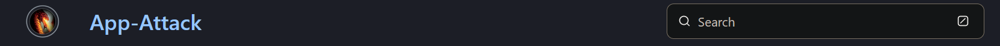
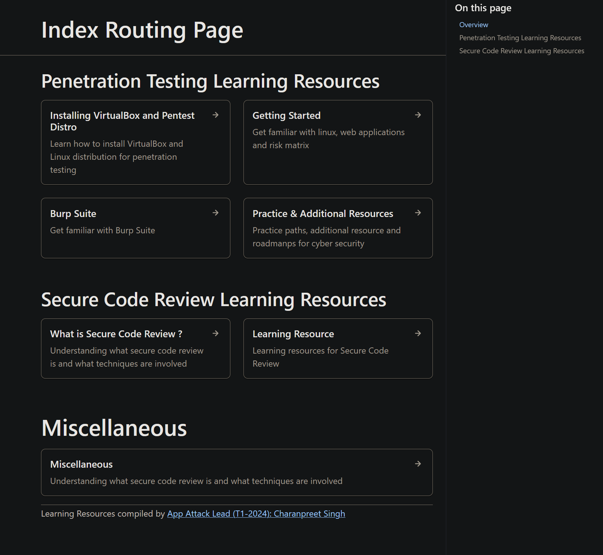

# AppAttack Docs using Astro and Starlight



```
logo: {
				src: './src/assets/app-attack-logo.png',
```
Added the logo to the search bar to have the logo every page you navigate to. This is just an aesthetic change to make the search bar look nice with the logo and also show that it is an "AppAttack" website.




```
<CardGrid >
	<Card title="Penetration Testing" icon="seti:stylelint">
	</Card>
	<Card title="Secure Code Review" icon="add-document">
	</Card>
</CardGrid>
```
Changed the cards to not be staggered so that it looks better with each of them being inline with each other.

I also started hosting AppAttack-Docs through Netlify, which makes it accessible to anyone on the internet. This allows for users currently working for AppAttack or users interested in AppAttack to view the skills and resources necessary to learn at AppAttack. Link: [AppAttack-Docs](https://app-attack-docs.netlify.app/).