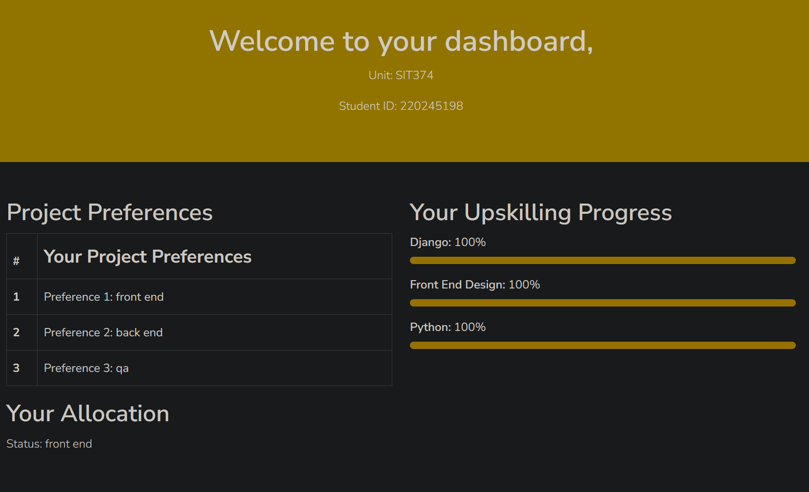
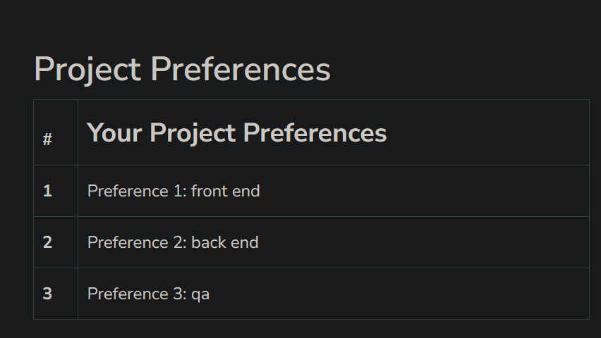
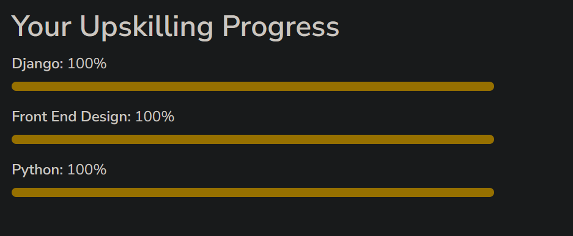
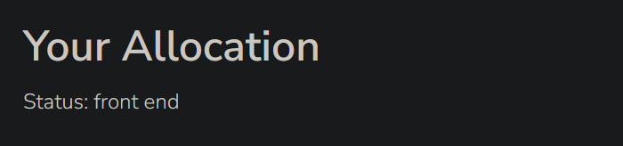

# Creation of Upskilling Dashboard





```
  <div class="container">
    <div class="row">
      <!-- Project Preferences Section -->
      <div class="col-md-6">
        <section class="pt-5">
          <h2>Project Preferences</h2>
          <table class="table table-bordered">
            <thead>
              <tr>
                <th scope="col">#</th>
                <th scope="col" style="font-size: 25px;">Your Project Preferences</th>
              </tr>
            </thead>
            <tbody>
              <tr>
                <th scope="row">1</th>
                <td>Preference 1: {{ student.p1 }}</td>
              </tr>
              <tr>
                <th scope="row">2</th>
                <td>Preference 2: {{ student.p2 }}</td>
              </tr>
              <tr>
                <th scope="row">3</th>
                <td>Preference 3: {{ student.p3 }}</td>
              </tr>
            </tbody>
          </table>
        </section>
      </div>
```
I created a table that displays three project preferences selected by the user which it takes the preferences from the backend and displays these preferences that are listed in the second column of the table.



```
      <!-- Upskilling Progress Tracker -->
      <div class="col-md-6">
        <section class="text-left pt-5">
          <h2>Your Upskilling Progress</h2>
          
          <div class="mb-3">
            <label for="progress">{{ p.skill.name }}:</label>
            <span>{{ p.progress }}%</span>
            <div class="progress" style="height: 10px;">
              <div class="progress-bar bg-warning" role="progressbar" style="width: {{ p.progress }}%;" aria-valuenow="{{ p.progress }}" aria-valuemin="0" aria-valuemax="100"></div>
            </div>
          </div>
          
        </section>
      </div>
    </div>
```
I implemented progress bars to visually represent the user's skill advancement in areas like Django, Python, Front-end, and more. These progress bars display the percentage of completion as text and visually illustrate the user's upskilling progress. It takes the progress from the back end and displays it.



```
    <!-- Allocation -->
    <section class="text-left pb-5">
      <h2>Your Allocation</h2>
      <p>Status: {{ student.allocated }}</p>
    </section>
  </div>

  <!-- End of section -->
</main>

```
This section is where the student gets allocated a project based on their preferences in the table. It takes the allocation that they have been given and it displays it. 

Doing the Dashboard for upskilling help me understand more about Django and especially the back end side as I can see where it all links it together. 