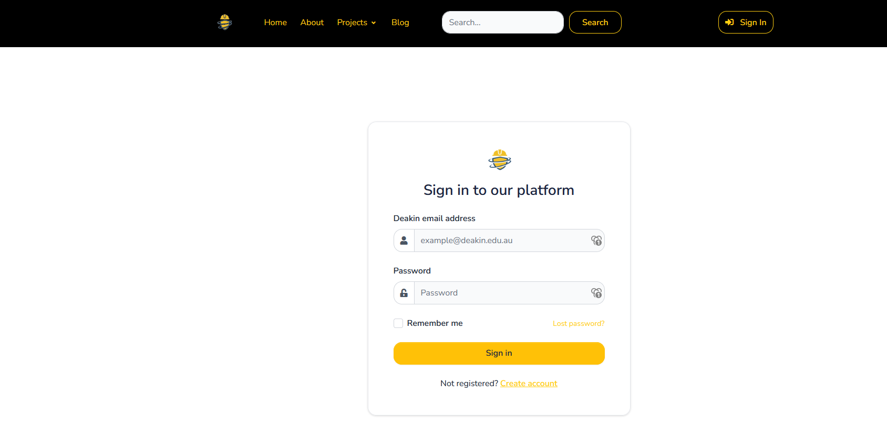

# Having Navigation displayed on all pages



 ``````

I integrated the pre-existing mavigation to the sign-up, sign-in, and reset password pages. Previosuly, they weren't displaying the navigation.

# Addition of A Upskilling Tab and Dropdown on the Navigation

<!-- Image -->

Code:
```

          
          <li class="nav-item dropdown">
            <a
              href="#"
              class="nav-link dropdown-toggle"
              id="frontPagesDropdown"
              aria-expanded="false"
              data-bs-toggle="dropdown"
            >
              Upskilling
              <span class="fas fa-angle-down nav-link-arrow ms-1"></span>
            </a>
            <div
              class="dropdown-menu px-0 py-2 p-lg-4"
              aria-labelledby="frontPagesDropdown"
            >
              <div class="row">
                <div class="col">
                  <ul class="list-style-none mb-4">
                    <li class="mb-2 menu-item">
                      <a class="menu-link" href=""
                        >Dashboard</a
                      >
                    </li>
                    <li class="mb-2 menu-item">
                      <a class="menu-link" href=""
                        >Skills</a
                      >
                    </li>
                  </ul>
                </div>
              </div>
            </div>
          </li>
          
```
When a user is signed into the website, the navigation will include an "Upskilling" dropdown. This dropdown will have two options:
1. Dashboard: This page allows for users to view their project preferences, allocations, and track their upskilling progress.
2. This page contains various links to skills such as Django, Front-end Design, Python etc. Which they can click on the links of the skills to be redirected to that page to upskill on those certain skills.

