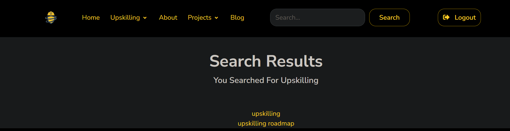

# Addition of Search Bar to Navigation


``` <form class="d-flex align-items-center" method=POST action="">
          
          <input class="form-control mr-sm-2" type="search" style="margin-left: 50px;" placeholder="Search..." aria-label="Search" name="searched">
          <button class="btn btn-outline-gray-100 me-md-3 px-4" style="margin-left: 10px;" type="submit">Search</button>
        </form>
```
Collaborated with Nick on implementing the search bar. I focused on the front-end aspect, incorporating the search bar into the navigation menu. Meanwhile, Nick handled the back-end development, ensuring the search bar was fully functional.

# Creation of Search Results Page



```
   <center>
      
      <div class="row">
        <div class="col-md-6 col-12 mx-md-auto mx-3 mt-7 mb-5">
          <h1 class="fw-bolder">Search Results</h1>
          <h5>You Searched For {{searched}}</h5>
        </div>
          

            <a href="">{{webpage}}</a>
            <br/>

          
      
        <h1>Empty Search, You may have forgotten to enter a search term?</h1>
      
    </center>
```

I collaborated with Nick to develop a search results page that displays the results from their search. It allows users to browse through the search results and find the specific information they are needing. 

