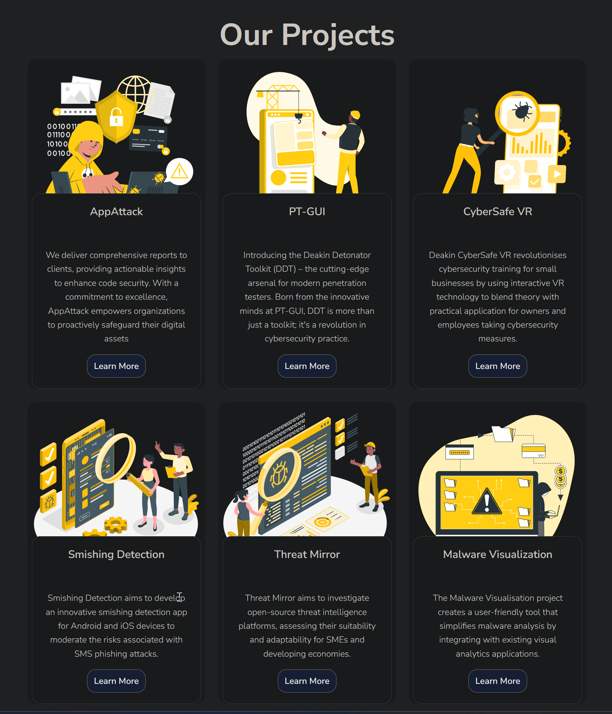

# Update to the What We Do html Page



```
            <!-- Projects -->
    <div class="container">
      <div class="row row-cols-1 row-cols-md-2 row-cols-lg-3 g-4">
        <div class="col">
          <div class="card border-0 overflow-hidden h-100">
            <div class="position-relative">
              
            </div>  
            <div class="card-body position-relative mt-n6 mx-2 bg-white border border-gray-300 text-center rounded d-flex flex-column">
              <h3 class="h5 card-title">AppAttack</h3>
              <p class="mt-3">We deliver comprehensive reports to clients, providing actionable insights to enhance code security. With a commitment to excellence, AppAttack empowers organizations to proactively safeguard their digital assets</p>
              <a href="">
                <div class="btn btn-secondary mt-auto">
                  Learn More
                </div>
              </a>
            </div>
```

I created cards for each project at HardHat Enterprises using the following code. The project descriptions were sourced from the company's structure and objectives file.